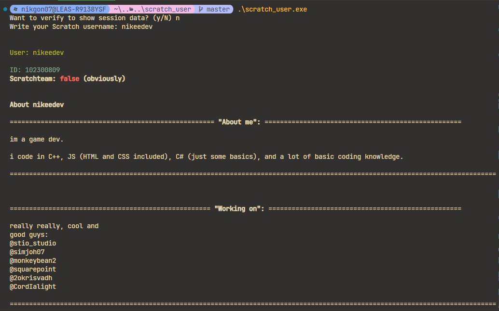

# Scratch user info

Using [Scratch API](https://api.scratch.mit.edu) for getting information about a user or a project

Also using Scratch's session server, you can login using a token (that will be retrieved trough the session server, to get more info like if you're a new Scratcher, or if you are banned (but are you...?)

# How does it work that you get a token for session information?

Well, it all begins with that Scratch has an authentication server on `https://scratch.mit.edu/login`. It's mostly recognizable as the Scratch's login page, but using HTTP, you can send an POST request in almost any programming language. You can send it your Scratch username and password in an struct, object, JSON, or whatever it is used on your language.

Sending that information about you, the login server will return a token as a cookie. That token is long, but it's functionality is to describe Scratch, that **that** token identifies you as *you (username)*. It's very important that you don't show it to anybody, or else they own a quarter of your account, and they can see e.g. your email or even your other token, which also exposes more control over your account, so don't save or publish username or password of your scratch account.

Now as the program knows your token, it can be used to do multiple things. Many of you heard about ScratchAttach (not advertised), it uses same method, by getting your password and username, and using it to get the token. That token like ScratchAttach, uses it for example to identify that your are "the scratch user" with name "name", and you are authorized to modify, delete, rename, and create cloud variables, as long as you are the owner of the project. That's how ScratchAttach including to other stuff there works. I did my version of cloud variable changing i used same way to authenticate using that token method with login page, and now i made that again just this time i retrieve session info.
#

 

<!-- lying on `https://scratch.mit.edu/session`. You can -->

## Here is a image preview or a sample of the program:

# To-Do:

- [x] Update the headers for about me and working on.
- [ ] Add country and time the user joined.
- [ ] Create also new UI for user session information.

